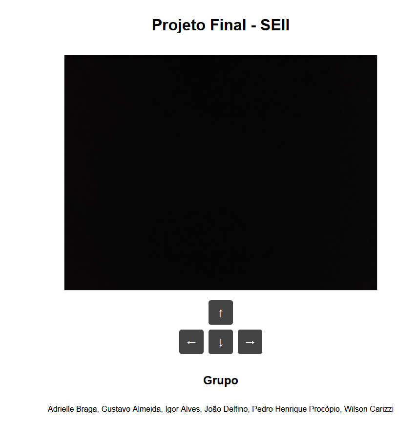

# Trabalho final Sistemas Digitais
## Controle de um carro com sistema embarcado pela web

O objetivo do trabalho era implementar um servidor em Linux, que receberia imagens de uma câmera e disponibilizaria o controle de um carro com sistema embarcado através de um site.

O trabalho foi realizado pelos discentes Adrielle Braga, Gustavo Almeida, Igor Alves, João Delfino, Pedro Procópio e Wilson Carizzi.

As imagens da montagem do carro estão disponíveis a seguir:

A câmera utilizada foi o celular de um dos alunos, com o aplicativo Droidcam instalado e enviando as imagens ao computador remotamente, pela rede.

O servidor foi construído em Node.js e se comunicava com a ESP8266, o microcontrolador utilizado, por web socket com a biblioteca ArduinoWebSockets.

A página web mostrava as imagens da câmera e disponibilizava botões para o contorle do carro, que também poderia ser realizado com as setas do teclado.

